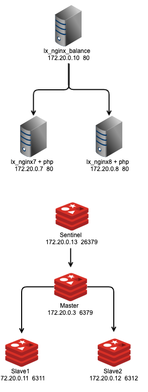

## 架构知识点：
Nginx：负载均衡，日志切割
Redis：哨兵高可用，一主两从，混合持久化

### Docker架构图:

### Tips:
- 1：master_sentinel.conf文件启动daemonize设置为no，确保有一个进程在前台，否则报错
- 2：conf文件因在启动哨兵节点后，master_sentinel的配置文件会被自动重写，可将conf.zip还原覆盖即可
- 3：[sentinel配置参数说明](https://blog.csdn.net/u010647035/article/details/90553596)

### 启动
`docker-compose -f test-nginx.yml up -d`